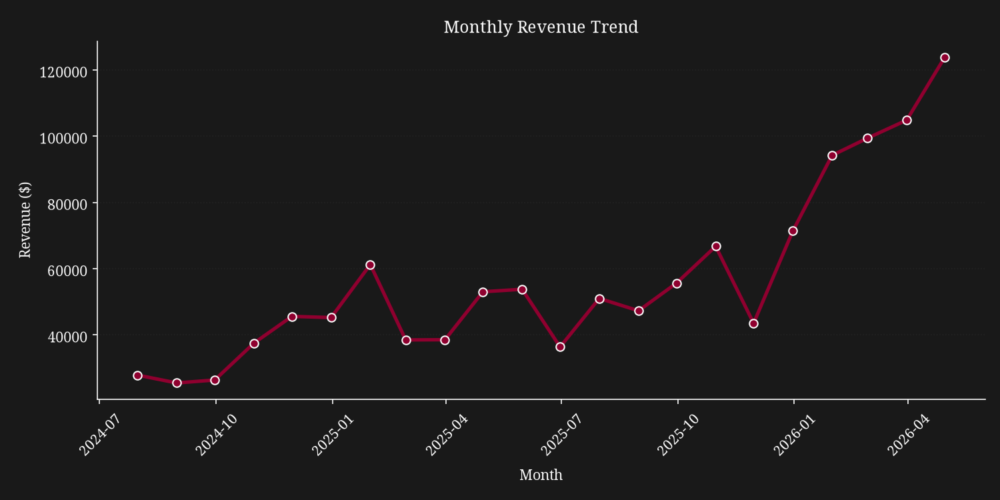
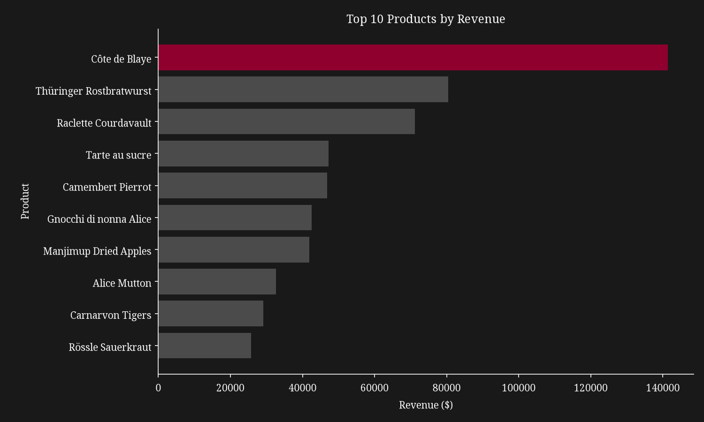
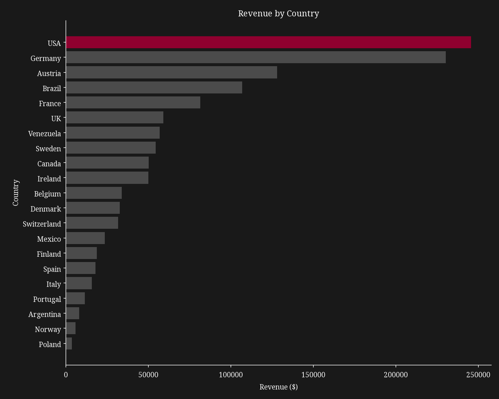

# Northwind Traders: Sales Performance and Growth Analysis

A data analysis project examining sales trends, product performance, customer concentration, and employee performance for Northwind Traders, a specialty food and beverage importer/exporter, using their historical order data.

## Business Question

How has Northwind's sales performance changed over time, and what is driving that growth or decline?

## Key Findings

- **Revenue grew steadily**, from about $27,800/month in July 2024 to $123,800/month by April 2026.
- **Product revenue is concentrated**: the top 3 products account for ~23% of all revenue, with Côte de Blaye alone contributing ~11%, a supply risk worth flagging.
- **Geographic revenue is concentrated in core markets**: the top 5 countries (USA, Germany, Austria, Brazil, France) generate ~63% of total revenue.
- **Sales team performance splits into two patterns**: high-volume sellers (e.g. Margaret Peacock) versus high-value-per-deal sellers (e.g. Anne Dodsworth).

## Visuals





## Data

This project uses the [Northwind Traders sample database](https://github.com/microsoft/sql-server-samples/tree/master/samples/databases/northwind-pubs), specifically the orders, order details, products, categories, customers, and employees tables. Supplier, shipper, and territory data were excluded, as they relate to logistics questions outside this project's sales performance scope.

## Tools

Python, pandas, matplotlib, seaborn, Jupyter Notebook

## How to Run

1. Clone or download this repository
2. Install dependencies: `pip install -r requirements.txt`
3. Open `notebooks/Northwind_Sales_Analysis.ipynb` in Jupyter or VS Code
4. Run all cells

## Project Structure

```
northwind-sales-analysis/
├── README.md
├── requirements.txt
├── notebooks/
│   └── Northwind_Sales_Analysis.ipynb
├── images/
│   ├── monthly_revenue_trend.png
│   ├── top_10_products.png
│   ├── revenue_by_category.png
│   ├── top_10_customers.png
│   ├── revenue_by_country.png
│   └── employee_performance.png
└── data/
    └── processed/
        └── sales_fact_table.csv
```

## Full Analysis

See the full notebook for detailed methodology, data cleaning steps, and findings for each section: notebooks/Northwind_Sales_Analysis.ipynb
